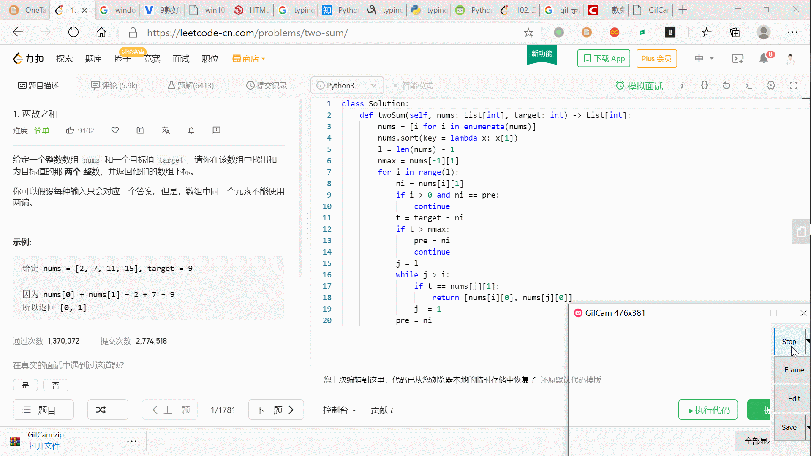
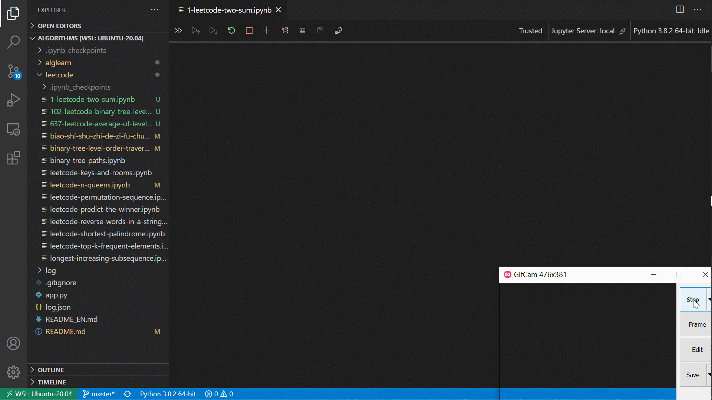
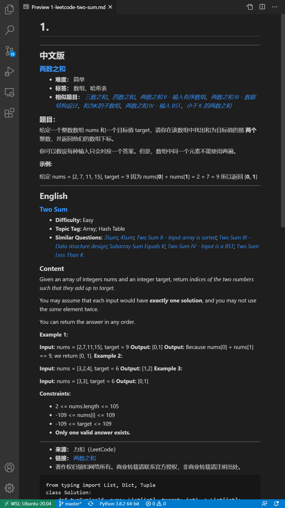

# **算法学习笔记**

---

&nbsp;&nbsp;&nbsp;&nbsp;通过**leetcode**的每日打卡，熟悉各类算法；记录下学习过的算法题，整理成**markdwn**文本；并根据打卡情况制定计划，着重学习自己难以甚至没有理解的算法。习惯用 **Jupyter Notebook** 进行学习，刚好 **notebook** 支持 **md** 和 **code** 的模式，然后 **ipynb** 支持输出成 **markdown** 文件。

---

&nbsp;&nbsp;&nbsp;&nbsp;坚持了十几天 **leetcode** 的题目打卡，并复制题目手动转 **md** 格式后，除了感觉做文档的过程耗费时间，而且由于每次 **md** 文档写得都不太一样，强迫症不能忍，决定做一个文档生成工具。

<!-- 了解了 **ipynb** 内容的格式要求，以及 **Jupyter Notebook** 库，构造**ipynb** 文件生成函数，并用爬虫根据链接爬取 **leetcode** 对应的题目，并转成 **md** 文件，自动插入到 **ipynb** 文件 **cells** 中。 -->

## **LeetcodeNotebook**

- ### **功能**
  - [x] 自动获取 **leetcode** 题目描述
  - [x] 题目 **html** 文档转 **md**
  - [x] **Notebook** 自动生成
  - [x] **Notebook** 自动输出 **md**
  - [ ] 算法学习过程分析

- ### **实现要求**
  - 爬虫
  - Html to Markdown
  - jupyter notebok 库

- ### **效果图**
  - 
  - 
  -  


## **安装**

### [**jupyter**](https://github.com/jupyter) **安装**

```shell
pip install jupyter  # pip安装`
```

### [**AlgLearn**](https://github.com/shenchucheng/algorithms)安装

#### **git** **获取源码**
```shell 
git clone -b v0.1 --depth=1 https://github.com/shenchucheng/algorithms.git
```
#### **wget** **获取源码**
  
```shell
wget https://github.com/shenchucheng/algorithms/files/5213756/algLearn.tar.gz
# 或者手动在 https://github.com/shenchucheng/algorithms/releases 下载源码解压即可
tar -xvzf algLearn.tar.gz
```

#### **安装依赖及测试**
```shell
cd algLearn
pip install -r requirements.txt
./app.py https://leetcode-cn.com/problems/two-sum/  # 测试获取leetcode题目
# 如果因为没有log目录而报错 mkdir log即可
```

#### **Notebook** **自动生成** **Markdown**
- jupyter notebook 文件是 json 格式，但是可以转化成 markdown 文本
- jupyter notebook 可通过配置文件 设置 post_save_hook 函数，每次文件保存会触发这个函数，因此每次修改完 leetcode notebook 笔记都会自动保存成 markdown 文件。
```
jupyter notebook --generate-config

vim ~/.jupyter/jupyter_notebook_config.py 
## 加入以下内容
import os
from subprocess import check_call
def post_save(model, os_path, contents_manager):
    """post-save hook for converting notebooks to .py scripts"""
    if model['type'] != 'notebook':
        return # only do this for notebooks
    d, fname = os.path.split(os_path)
    if 'leetcode' in d:
        mddir = os.path.split(d)[0]
        mddir = os.path.join(mddir, 'md')
        check_call(['ipython', 'nbconvert', '--to', 'markdown', '--output-dir', mddir, fname], cwd=d)
c.FileContentsManager.post_save_hook = post_save
```

#### **启动 Notebook**
```
jupyter notebook
# 后面打开leetcode的ipynb文件并保存就会在../md目录下生成对应markdown文件
```
